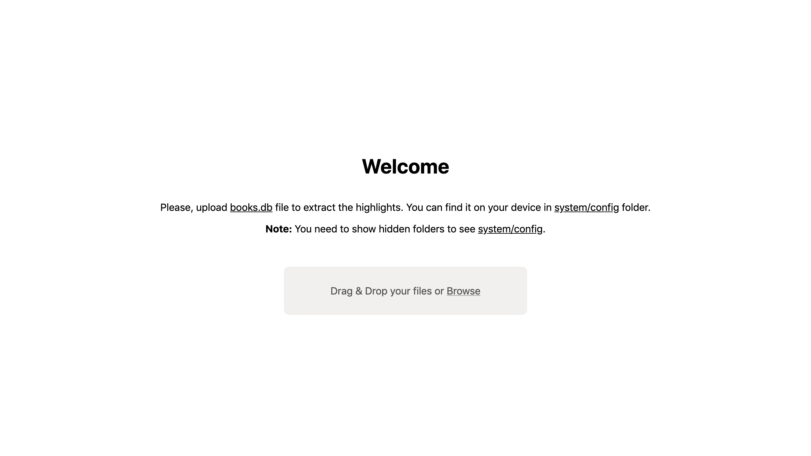
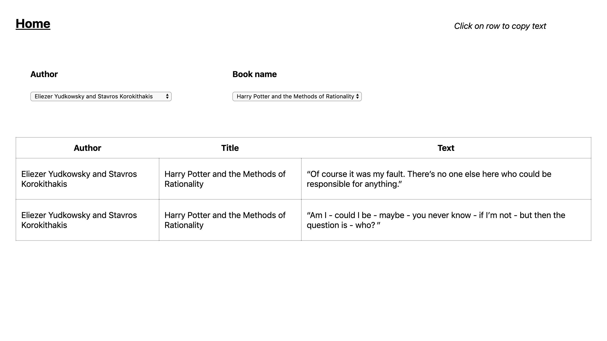

## Export Pocketbook highlights

Export highlights from your Pocketbook.

1. Start project (`npm i && npm start`) and go to http://localhost:9000.
2. Upload <u>books.db</u> file there in accordance with the instructions on the site.
3. Tadam! You can see the list of your highlights.

### TODO

- [x] See the list of highlights.
- [x] Copy highlight by click.
- [ ] Sort highlights by author and book name.

### Screenshots

|   |
|---|
|   |
